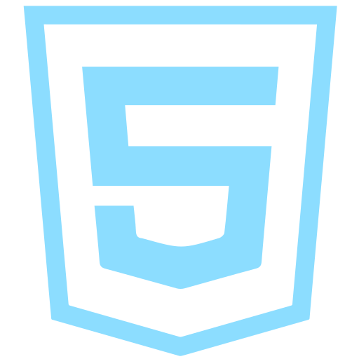
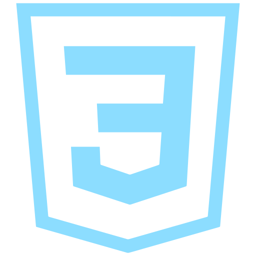
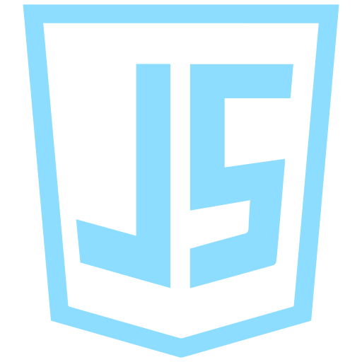
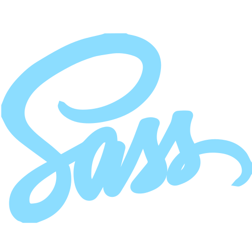
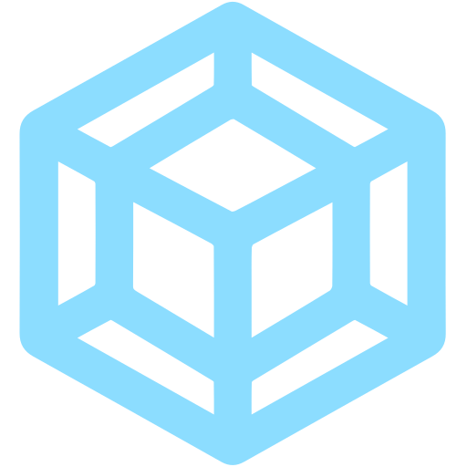
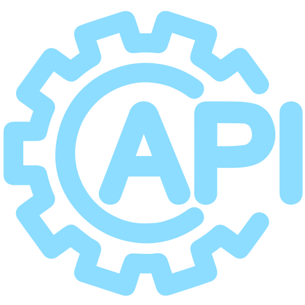
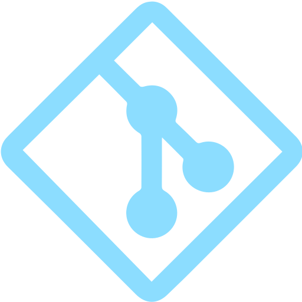
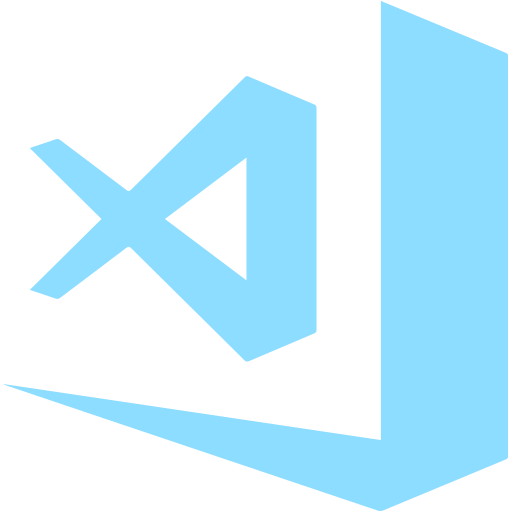

## Intro

- 💻 Web development is my fascination 🎯 and part time work 🚀.
- 💼 Despite the fact that I studied 👨‍🎓 law at university and worked as a judge's assistant for several years, this experience gave me valuable skills such as ***punctuality***, ***meticulousness*** and ***stress tolerance***.
- 🏆 Few years ago I started to learn [networking](https://www.credly.com/badges/72883930-5411-44c6-a176-095d591a15d6?source=linked_in_profile) and [web development](https://app.rs.school/certificate/q97ro2jw). Currently, I take a RS School [Javascript/Front-end](https://github.com/rolling-scopes-school/tasks/tree/master/stage1) course.

## Skills and Tools









<br>


## Languages 

```English (B2)```, ```Polish (B2)```, ```Ukrainian (Native)```, ```Russian (Native)```

## Contacts

[](https://t.me/Jan_Grycan)
[](https://discordapp.com/users/728380730018889869/)
[](https://www.linkedin.com/in/ivanhryhoriev/)
[](mailto:admin@web-architect.pro)