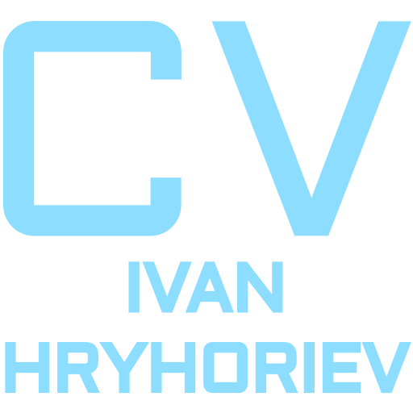

## Intro

- 💻 Web development is my fascination 🎯 and work 🚀 at the same time.
- 💼 FrontEnd Web Developer experienced in a variety of platforms, that are cross browser and cross device compatible, including:  Vue, Laravel, Javascript, HTML5, SQL, CSS3/SCSS, Bootstrap, PHP, Webpack, Git/GitHub, VS Code, Photoshop, Illustrator, Adobe XD, Figma, Wordpress, ACF

## Skills and Tools


<br style="clear: both;">

## Languages 

```English (B2)```  ```Polish (B2)```  ```Ukrainian (Native)```  ```Russian (Native)```

## Contacts and my CV

[](https://t.me/Jan_Grycan)
[](https://discordapp.com/users/728380730018889869/)
[](https://www.linkedin.com/in/ivanhryhoriev/)
[](mailto:admin@web-architect.pro)
[](https://gricyan.github.io/rsschool-cv/)

